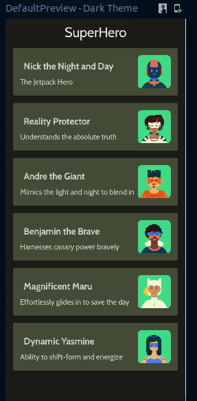
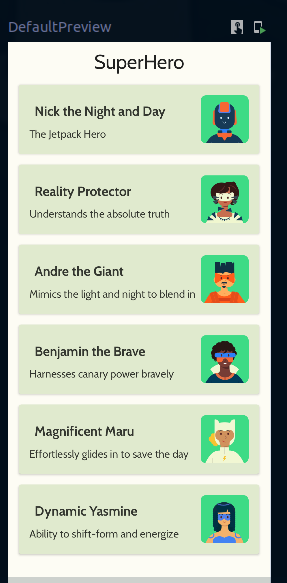

SuperHero
==================================
**🚧 Project Status: Under Active Development 🚧**

The SuperHero app is a list of Heros photos with information about them including their powers
and their description. This app also uses Material Design to create a beautiful app
experience for the user.

Screen-Shot
------------
 

Pre-requisites
--------------

-Rows/Columns
-Modifiers
-Scaffold
-Adding images
-Button click handlers
-Functions
-Classes
-Lists
-App architecture

Getting Started
---------------

1. Download the project
2. Open the project in Android Studio
3. Run the project
# Compose-Material-SuperHero
